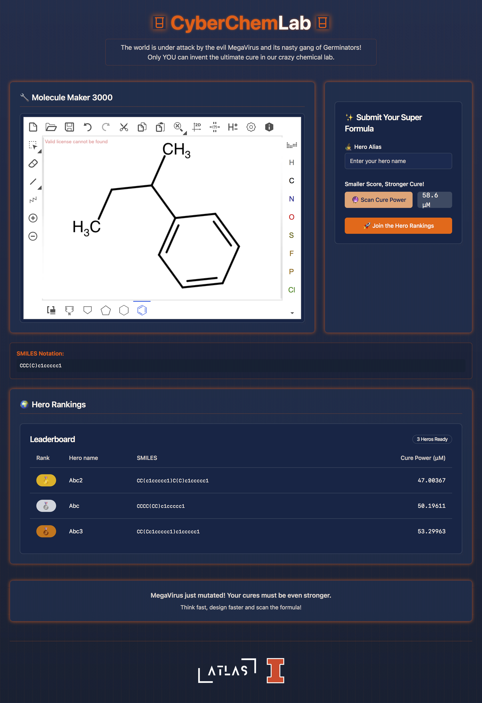

# Design Your Cure 🦠🔬

## Project Overview

Design Your Cure is an interactive web-based platform that combines scientific exploration, machine learning, and gamification to accelerate drug discovery. Inspired by the challenge of combating viral threats, this project allows users to design molecular structures and receive real-time predictions of their potential effectiveness against the SARS-CoV-2 main protease.



### 🎮 Game Concept

In this innovative educational game, players take on the role of a molecular designer, battling against virus particles by creating and testing potential drug molecules. Your mission is to design the most effective molecular structures to combat viral infections.

## Key Features

- 🧪 Interactive Molecular Design Interface
- 🤖 Real-time Machine Learning Predictions
- 📊 Dynamic Leaderboard System
- 🎯 Focus on SARS-CoV-2 Main Protease Research

## Technology Stack

### Frontend
- React
- TypeScript
- Vite
- Tailwind CSS
- shadcn-ui

### Backend
- Python
- Flask
- Machine Learning Models (Random Forest)
- RDKit
- TensorFlow

### Research Methodology
- QSAR Modeling
- Molecular Fingerprint Analysis
- IC50 Value Prediction

## Prerequisites

- Node.js (v14+ recommended)
- npm
- Python 3.8+

## Installation and Setup

### 1. Clone the Repository

### 2. Backend Setup

```bash
# Create a virtual environment (optional but recommended)
python -m venv venv
source venv/bin/activate  # On Windows, use `venv\Scripts\activate`

# Install Python dependencies
pip install -r requirements.txt

# Start the backend server
python backend/api.py
```

### 3. Frontend Setup

```bash
# Navigate to frontend directory
cd frontend

# Install npm dependencies
npm install

# Replace IP configuration
# Edit frontend/src/config.ts and replace "YOUR_IP" with your local IP address

# Start development server
npm run dev
```

## How to Play

1. Open the web application
2. Design your molecular structure
3. Submit your molecule
4. Receive instant IC50 prediction
5. Compare your results on the leaderboard
6. Iterate and improve your designs

## Hosting the Game

To host the game on your local network:

1. Replace the IP address in `frontend/src/config.ts` with your machine's IP address

2. Start the backend API:
```bash
python backend/api.py
```

3. Start the frontend development server:
```bash
cd frontend
npm run dev
```

## Research Impact

This project demonstrates how machine learning and interactive platforms can:
- Accelerate drug discovery
- Provide accessible scientific exploration
- Engage users in cutting-edge research

## Future Improvements

- Expand to more protein targets
- Integrate deep learning models
- Enhance prediction accuracy
- Broaden molecular design capabilities